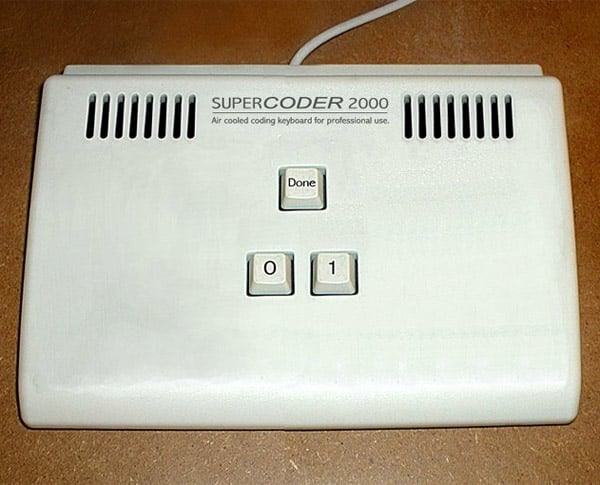

# Introduction

<!-- Thought is not merely expressed in words, it comes into existence through them - Lev Vygotsky. -->
> How we program influences how we think about computation and vice-versa - Louden & Lambert.


## Goals
* Introduce notions of programming languages
* Outline basic concepts of programming language design

We introduce the principles and concepts underlying programming languages.  It is not about specific programming languages, however, specific languages are used to illustrate these principles and concepts.  

### History of Programming Languages

#### Machine Language

At the lowest level, computers understand binary code.  For example, 16-bit machine language program containing 4 instructions could be:

```
0011011010011010
0000000000000101
0000000000000110
1001110101011111
```

Different part of the 16-bits are used for operation, memory location, and data values.  __Opcode__ is the part (say, first 4 bits) for the operation.


The programmer could use the following to enter these instructions:

[](../images/supercoder_2000_binary_keyboard.jpeg)


#### Assembly Language

In the 1950's mnemonic symbols were used for instruction and memory locations.  The __assembler__ translates the symbolic assembly language code to binary machine code.  Here is a 1 line assembly code:

```
LD R1, FIRST
```


## Abstractions in Programming Languages

Central to making programs easier to read, abstractions fall into two categories:

1. __data abstraction__ 
2. __control abstraction__

### Data: Basic Abstractions

Often the programmer cannot access of the hidden internal representaions of common data values.  For example, 
integers are often sotred using two's complemnt representation.  Real numbers are stored using IEEE single- or double-precision machine representations.  The component parts are not accessible.


### Data: Structured Abstractions

A __data structure__ is a method of collecting and storing related data into a single unit.  The data structure can be viewed as a single unit contain a collection of parts.  The principle data structure is the __array__, in C

```
int x[10];
```

### Data: Unit Abstraction


### Control: Basic Abstractions


### Control: Structured Abstractions


<!-- ------------------------------------- -->
## Computational Paradigms

Programming languages imitate and abstract the operations of a computer.


<!-- ------------------------------------- -->
## Language Defintion

### Syntax


### Semantics


## References
```
@book{louden2011programming,
  title={Programming languages: principles and practices},
  author={Louden, Kenneth C and Lambert, Kenneth A},
  year={2011},
  publisher={Cengage Learning}
}

@book{vygotsky2012thought,
  title={Thought and language},
  author={Vygotsky, Lev S},
  year={2012},
  publisher={MIT press}
}
```
